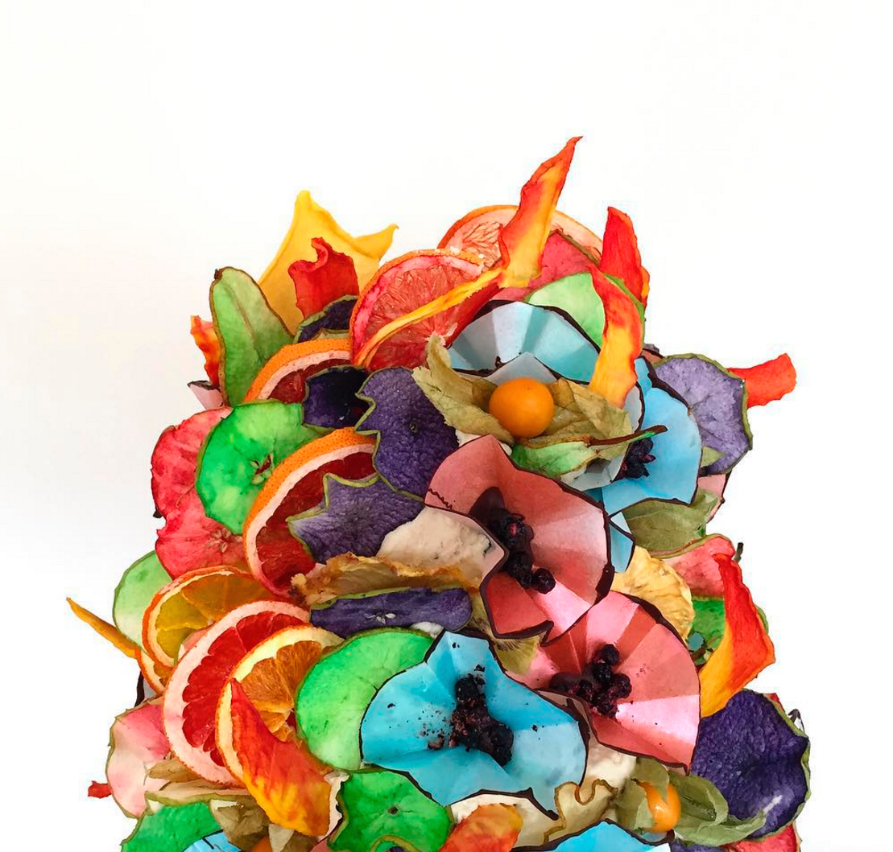

_‘I do not use fondant icing […] It’s kind of a rule that I don’t touch it.’_ These are the defiant words of Helen Bakunowicz - aka The Bakemonger - a cake maker so unique in style and quality it’s hard not to agree with her strident views on sugar paste. When Helen makes a cake, it’s a deeply creative process often involving weeks of research and testing. From ombre dying dried fruit to rice paper origami, the techniques used to create a Bakemonger original yield incredible results that resemble more fine art sculpture than edible treat.

But edible they necessarily are. _‘My focus has always been that [the cakes] have to taste great as well, and you have to be able to eat everything’_, Helen explains. _‘I started colouring [dehydrated fruit] naturally. The fruit looked like petals and looked beautiful as a decorative, edible thing. I experimented with those and how they could be moulded and twinned […] I’m always fiddling around with things to create different textures.’_

Helen trained as a textile designer at Brighton University and went into print design and trend and colour forecasting after graduating in 2001. It was while working on trend mood boards that were becoming more and more dominated by foodie visuals that she realised she might be slightly obsessed. Speaking about her move into baking, Helen says, ‘It’s such a creative sector. Something made me want to push boundaries a little more.’ She soon realised that the techniques she was using were very different from anything already out there: ‘I layer up flavour the same way that I layered up yarns and colours previously [and] I think it’s really important that it’s abstract.’

Being creative is obviously hugely important to Helen. Discussing her process and motivation, she says, ‘Not having patisserie training but having the creative background is quite an interesting mix. It’s nice to be the maker again; you’re basically talking about other peoples’ creativity with trend forecasting. [Now] it almost feels like I’m back at university because I’m making again. [Cake is] an actual thing that you hand over, and cake is always happy, something that people share. Sometimes the fashion industry doesn’t work like that.’

I first discovered The Bakemonger through Instagram. What struck me while poring over the images of cascading dried pear slices and bold geometric chocolate shards was how on earth these cakes were actually made. Luckily, Helen has started a Concept page on her website to give a little background into some of her creations. She believes that while we are visually saturated with images on platforms and sites like Instagram, ‘people are really interested in how you make something, and the thinking behind it.’ 

She says, ‘I really value and respect the prices of things that are made by other makers […] because I know where it’s come from; it’s not from Ikea, it’s worth it.’

Helen’s current creative crush is another local maker from her home town of Frome, Elizabeth Barry who works with porcelain and has recently started making jewellery. Helen explains, ‘She’s taken a classic material and she’s using it in a very different way. It’s the unexpected, but not in a crass way; she’s managed to create something that’s classic and contemporary at the same time.’ Words that could easily be used to describe the way in which Helen herself works.

I ask Helen what we can expect from The Bakemonger in the coming months. As well as hunting new premises for her business - currently run from her kitchen - she has been approached by Harrod’s to put on a 3 month branded pop up in their patisserie section, something she sees as a ‘great opportunity’. In the meantime, she continues to take commissions, and supplies a small number of cakes to Caro, a lifestyle shop and cafe in Bruton, Somerset, as well as taking part in the Frome Independent market on the first Sunday of every month (March - December).

You can find The Bakemonger [online](https://www.thebakemonger.com/), on [Instagram](https://www.instagram.com/the_bakemonger/), and on [Twitter](https://twitter.com/thebakemonger).
