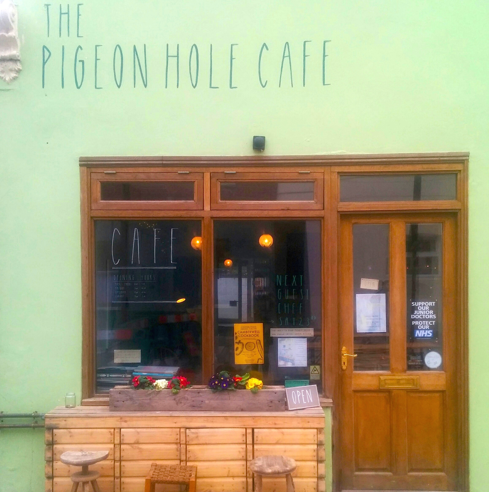

**Name:** The Pigeon Hole

**Owners:** Holly and George

**Age:** 2 years (approx.)

**Location:** Camberwell

**Background:** About 4 years ago, friends Holly and George decided to open a cafe. Both hailing from creative careers - Holly in arts education, George in prop and set design - the cafe was always going to be stylish, individual, and with a lot of handmade elements.

'The romantic idea of owning a small independent cafe that worked closely with the community we both lived in and provided us a space to design and build from scratch was something very appealing,' says Holly. 'We both already had a love for cooking but it was through the process of setting up the cafe that we became incredibly excited and passionate about all the local artisan produce that lay on our doorstep.'

After a blindingly successful Kickstarter campaign and almost a year of searching for the perfect location, The Pigeon Hole opened in June 2014. It's since become a local favourite, serving a range of locally produced food and drink - think Volcano Coffee from West Norwood, pastries from Christopher's in Herne Hill, and sumptuous cakes from Smash Bang Dollop in Crystal Palace - as well as hosting film nights, jewellery workshops, life drawing classes, and guest chef supper clubs.

**Why go there?:** Aside from the delicious food, The Pigeon Hole has an incredibly relaxed atmosphere that makes any visit a pleasure. The decor is simple but memorable - exposed ply wood edging, second hand lamp shades, and a range of mid-century furniture, all of which is for sale. As Holly explains, 'the design of the cafe is and has always been a very important part of the its atmosphere and we try and subtly change the design of the space with the seasons, creating softer furnishings and cosier table placements in the colder months and cleaner lines and brighter colours in the warmer months.'

The cafe also supports local artists and makers with a rotating exhibition on the walls and hand crafted products to buy. With the newly pedestrianised area outside the cafe, The Pigeon Hole will be the place to relax this summer.

**What they say:** _'We wanted to achieve a space that people felt at home in.'_

**What we say:** _'Home in. It's awesome.'_

You can find The Pigeon Hole online, on Instagram, and on Twitter. Visit the cafe at 2 Datchelor Place, Camberwell SE5 7AP.