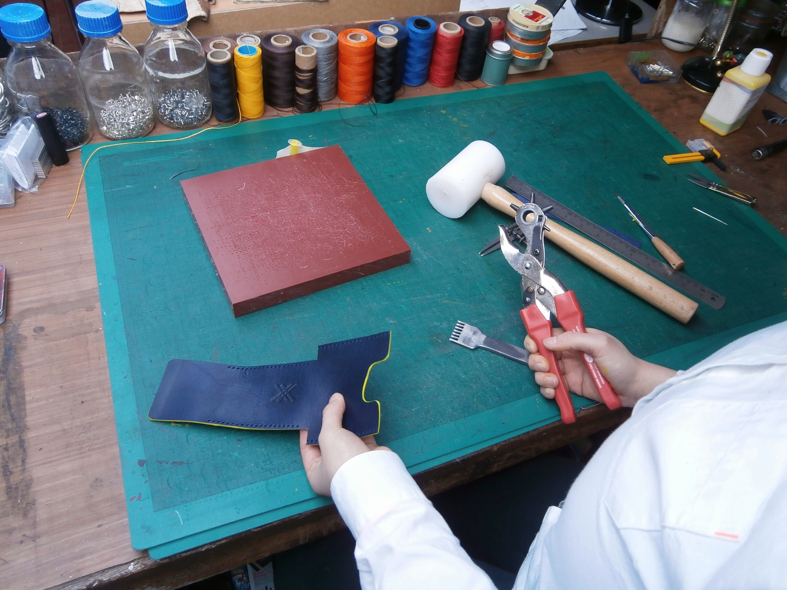
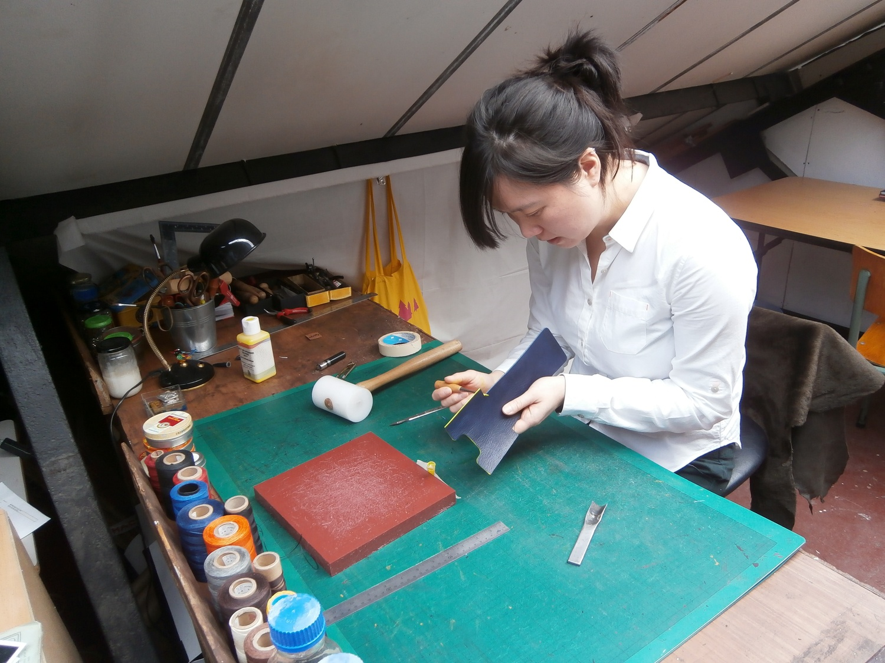
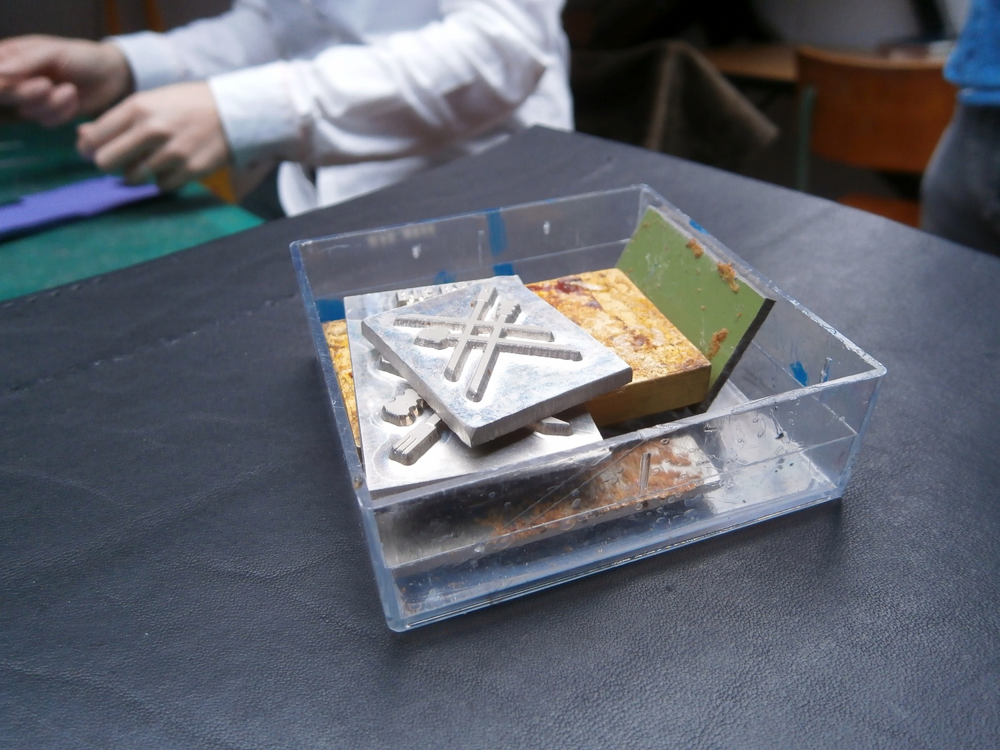
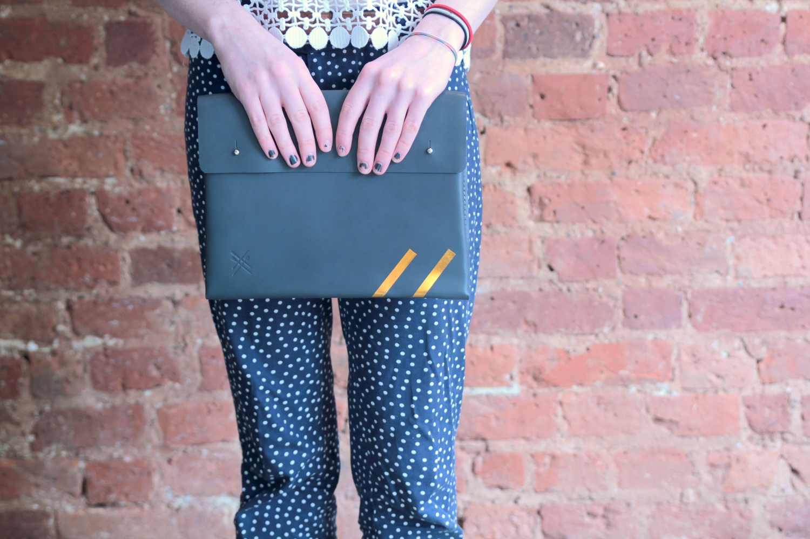

  <iframe class="aspect-ratio--object" src="https://player.vimeo.com/video/123363680?wmode=opaque&api=1" frameborder="0" title="LOIS presents - Kuku Big Bag" webkitallowfullscreen="" mozallowfullscreen="" allowfullscreen=""></iframe>

Since starting to work with leather in 2011, Candice Lau - designer behind Kuku Big Bag - has established herself as a maker of simple, functional and essentially stylish bags and accessories.

Using the traditional method of saddle stitching, everything Candice makes she makes by hand from cutting the leather, to sewing the pattern together, to securing the studs and poppers.

I really enjoy how Candice’s pieces are so unfussy; you can tell at once that they’re incredibly well considered, but they don’t look complicated despite the amount of work she puts into each one. The exclusive clutches we collaborated on echoed this minimal aesthetic, something we thought would add to their versatility.

