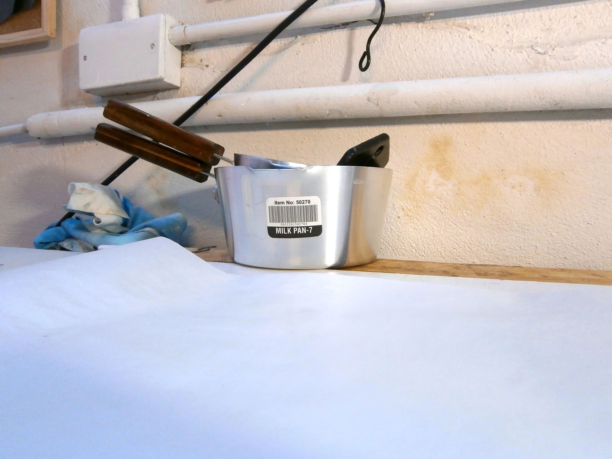
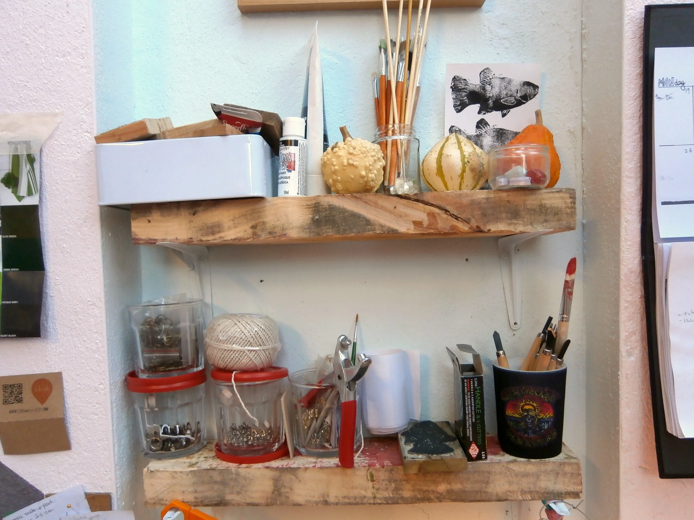
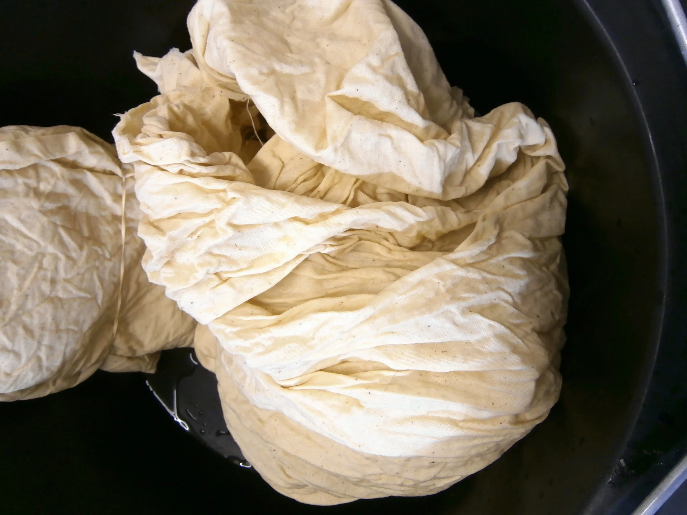
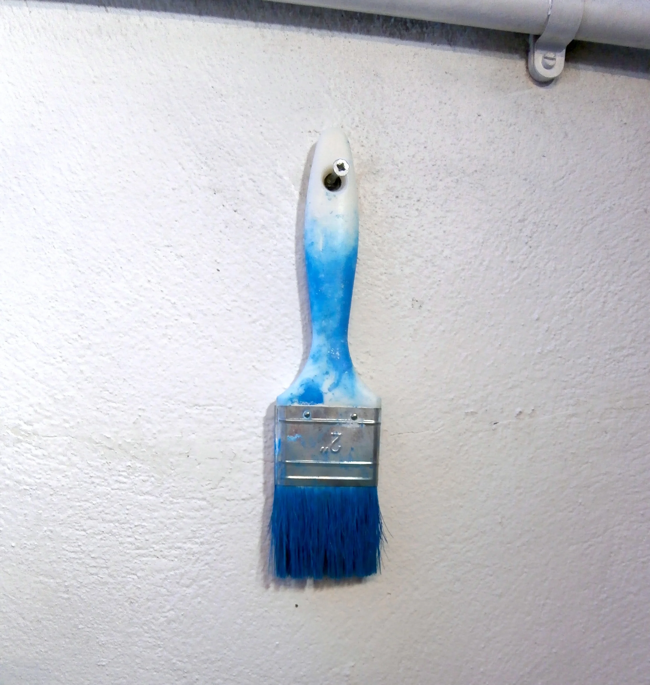
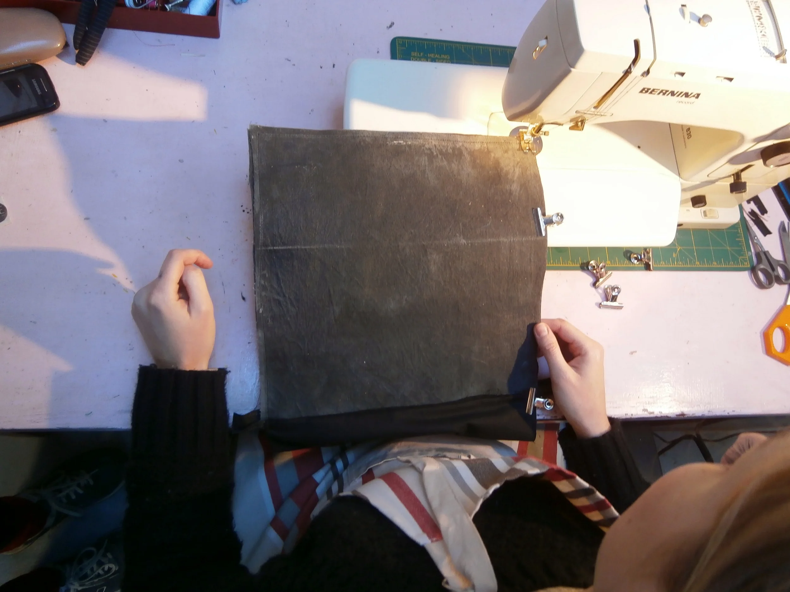
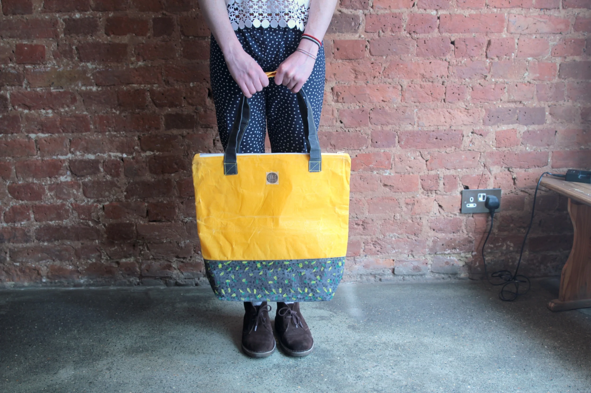

  <iframe class="aspect-ratio--object" src="https://player.vimeo.com/video/123363677?h=ccca93e4c6" frameborder="0"allow="autoplay; fullscreen; picture-in-picture; clipboard-write; encrypted-media; web-share" allowfullscreen></iframe>

When I first found out how Alison Vard - designer behind Ciré - made her bags and accessories, I was totally amazed. Not only does she hand dye all her own fabrics, she then hand waxes them with a mixture of bees- and paraffin wax so that the fabric becomes water resistant. Only then does she move onto the task of actually making anything with the pre-prepared material. It’s labour-intensive, but the end results are incredible - hard-wearing, multi-functional and very stylish.

When we went to film Alison, we didn’t realise that her studio sits within a much larger unit where a company imports bristles used for making brushes and brooms. I can honestly say that until then, I had never considered the process behind making a broom or brush, but it makes sense that I should think about it on the day we were to film behind-the-scenes with Alison and find out exactly how she makes her collection.

I was so excited about collaborating with Ciré on a series of exclusive bags. I’m a huge fan of bright colours and patterns so taking the interior design of the London Underground as inspiration was ideal. It also meant that Alison could use block printing on the bags to produce the speckled pattern, just another thing to add an extra level of hand made individuality to each item.

