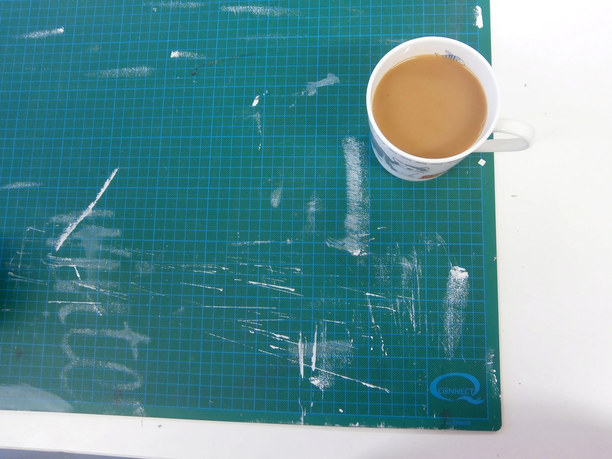
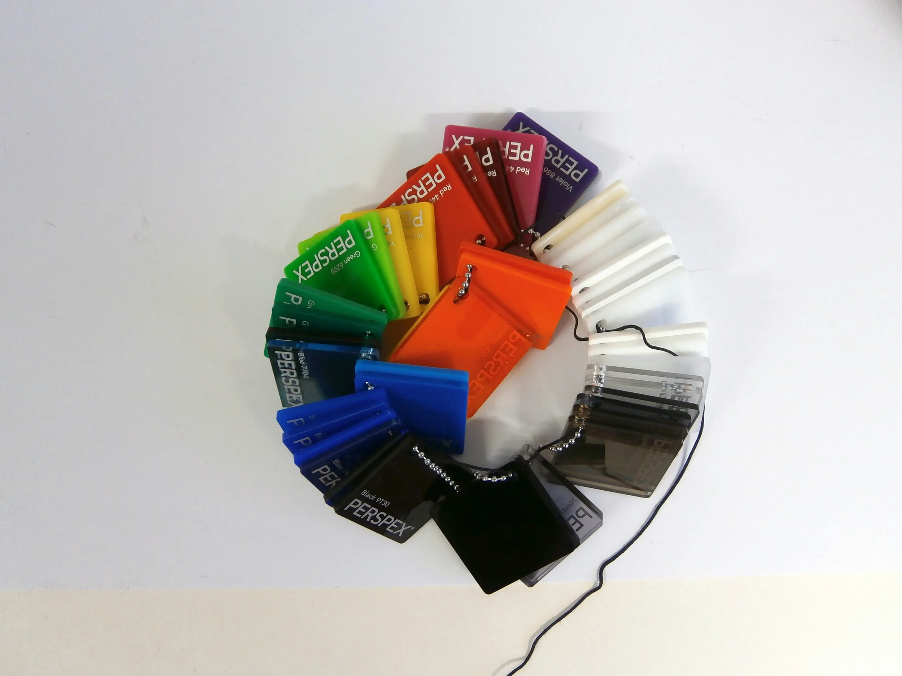

  <iframe class="aspect-ratio--object" src="https://player.vimeo.com/video/123417537?h=1ed9931e67" frameborder="0"allow="autoplay; fullscreen; picture-in-picture; clipboard-write; encrypted-media; web-share" allowfullscreen></iframe>

Lucy and Lukas, the creative pair behind laser cutting and design studio Dot Laser, have plenty of experience - they met working at another laser cutting studio, but a desire for a more personal, client-focused approach pushed them to start their own outfit. Which is really lucky because they know exactly what they’re doing and they're both incredibly nice people.

Our aim was to get Dot Laser to cut out the designs created by Pen & Gravy for a set of acrylic coasters and place mats. Neither Jamie (Pen & Gravy) nor I had ever worked with acrylic before, so it was up to Lucy and Lukas to guide us through a process that was slightly terrifying because it involved FRICKIN’ LASER BEAMS!

Luckily, the results look amazing - little pieces of geometric design that smell slightly of burnt toast, a result of having been cut out by a really hot laser.

