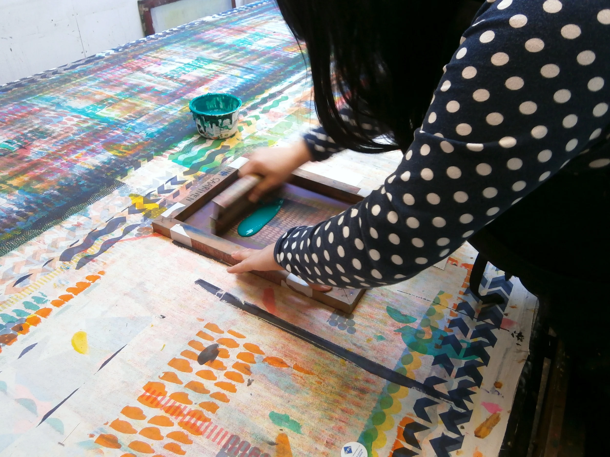
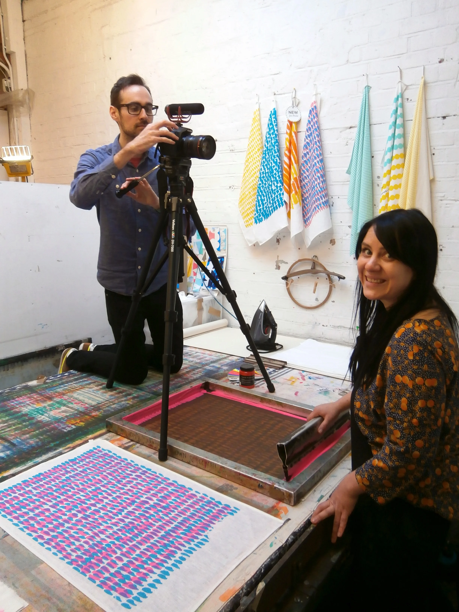

  <iframe class="aspect-ratio--object" src="https://player.vimeo.com/video/123417535?h=2fb6c2e450" frameborder="0"allow="autoplay; fullscreen; picture-in-picture; clipboard-write; encrypted-media; web-share" allowfullscreen></iframe>

Jonna is one of the nicest people I’ve ever met, so working with her on a collaboration for the exclusive LOIS collection was really fun. With years of experience in screen printing, and a genuine love and enthusiasm for the craft, she makes the process fun and interesting as well.

It also helps that she uses THE BRIGHTEST COLOURS EVER CREATED BY MAN. I’ve started dubbing her textiles ‘rave tea towels’ because they almost incite lasers and glow sticks with their mere presence in the kitchen.

Jonna views each printing session as a bit of an experiment - sometimes, fun new colour combinations are discovered by accident when one ink is stronger than usual, or if colours are printed in a different order. And because she prints all her textiles herself, each one is ever so slightly different from the last, adding a hand made charm to every piece. I’m really proud of the brightly coloured scarves we created using her signature spots print.

