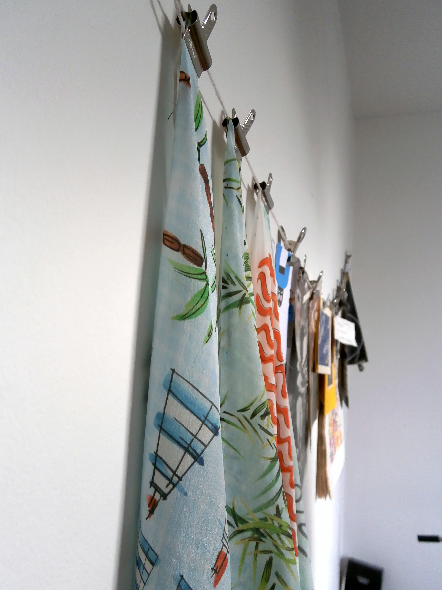
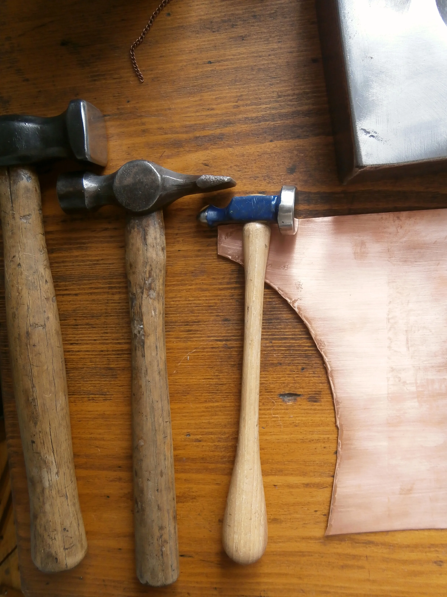
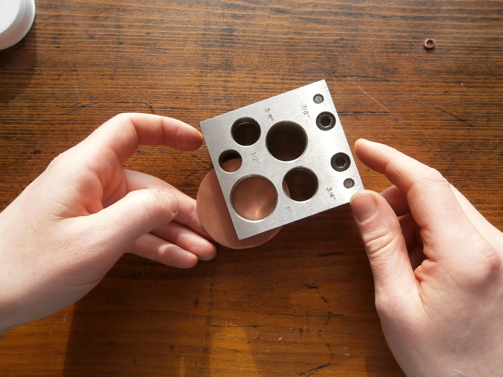
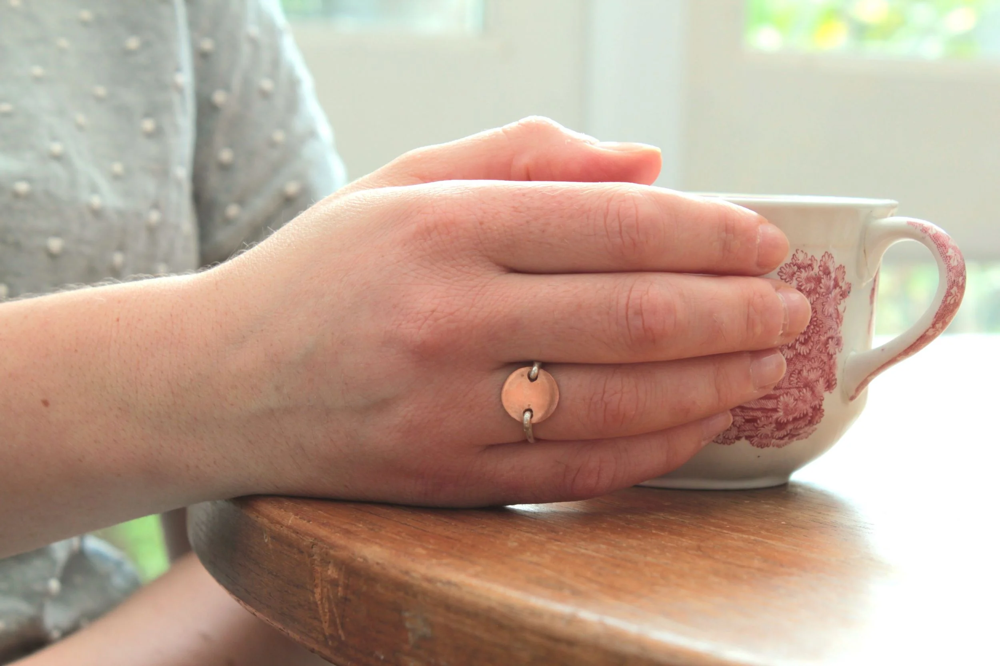

  <iframe class="aspect-ratio--object" src="https://player.vimeo.com/video/123363682?h=262ca47e35" frameborder="0"allow="autoplay; fullscreen; picture-in-picture; clipboard-write; encrypted-media; web-share" allowfullscreen></iframe>

It’s fair to say that Laurie Yeomans is a multi-skilled individual. As well as honing her abilities as a jewellery maker, creating exquisite pieces mostly from recycled copper, she’s also a print designer, dress maker and barista. I can also vouch for her sandwich and cake making abilities.

She works in a little studio in her flat, surrounded by the implements of her trade, and often interrupted by Paddy the dog. With a blacksmith as a father, it’s no surprise that Laurie finds great joy in discovering and using the various tools involved in the jewellery making process. Her recent acquisition - a sheet metal hole punch - has provided immense pleasure, mainly because she gets to hit a bolt of metal really hard and make a lot of noise.

Laurie was a really fun person to collaborate with because she’s always up for trying new things. Her exclusive bracelet and ring designs for LOIS represented her first foray into silver work, a material she now hopes to continue using for future projects. So definitely watch this space.

