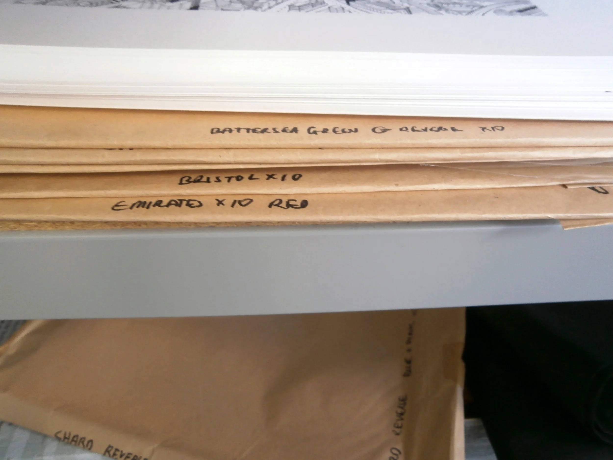

  <iframe class="aspect-ratio--object" src="https://player.vimeo.com/video/123395480?h=c962ace4dd" frameborder="0" referrerpolicy="strict-origin-when-cross-origin" allow="autoplay; fullscreen; picture-in-picture; clipboard-write; encrypted-media; web-share"   allowfullscreen></iframe>

Will is a Londoner through and through, so it’s no surprise that so many of his illustrations depict details of the capital’s sprawling architecture. I love the intricacies of his drawings and the way they contrast so strongly with the bold colours he screen prints alongside them. You feel that you could look at each picture for hours, noticing something different each time.

I was really excited to work with Will on an exclusive piece for LOIS. The trick was trying to come up with something that was both beautiful to look at and functional in some way. The concertina came from an initial idea to create a children’s book depicting scenes in and around London. But we wanted people to be able to admire the pictures everyday, to display them, as well as be able to learn something new about the city. The end result was incredible - the amount of detail in each illustration almost reflects the process of building the structure in the first place.

I’d say Will is probably one of the most patient people I know after watching him translate buildings and cities into drawings in his Brixton studio. Painstaking doesn’t really do it justice.

