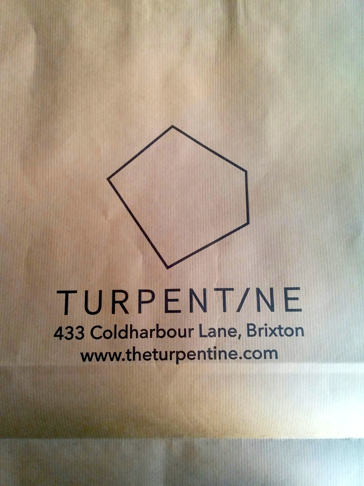
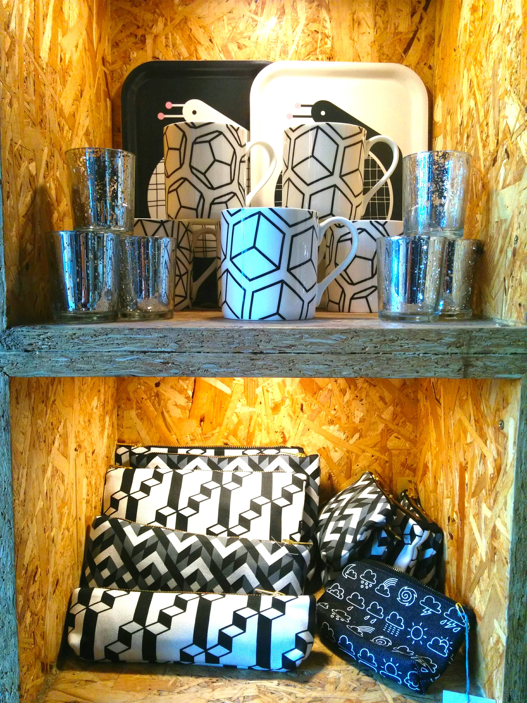

**Name:** The Turpentine

**Owners:** Jude, Alice & Amber

**Age:** 2 years

**Location:** Brixton

**Background:** The Turpentine began as a series of craft markets in south London. You might remember the excellent 'Turpentine Takeover' events held at Living and the Effra Social in Brixton - a cool mix of handmade design talent, workshops and music. When a shop on Coldharbour Lane became available, it was the perfect opportunity for co-founders Amber, Alice and Jude to put their creative mark on the area.

**Why go there?:** The shop is full of incredible design talent. From hand printed cards and prints to jewellery (including The Turpentine's own range of wood-metal necklaces and earrings), homeware, textiles, and accessories, it's the perfect place to find a gift, or to pick up a unique piece of design for yourself. You can also flex your inner creative at one of the many Turpentine workshops. There are one-off classes and longer courses to suit a variety of creative curiosities; painting, jewellery making, and the ever popular 'drink & draw' sessions are but a few of the available and constantly evolving options. Expect more in the way of collaborative classes in the future, held in tandem with UK designers like i am acrylic.

**What they say:** _The Turpentine is about celebrating creativity._

**What we say:** _It's the turps._

You can find The Turpentine at https://www.theturpentine.com/, on [Instagram](https://www.instagram.com/the_turpentine/), and on [Twitter](https://twitter.com/the_turpentine). Or visit the shop at 433 Coldharbour Lane, Brixton SW9 8LN.