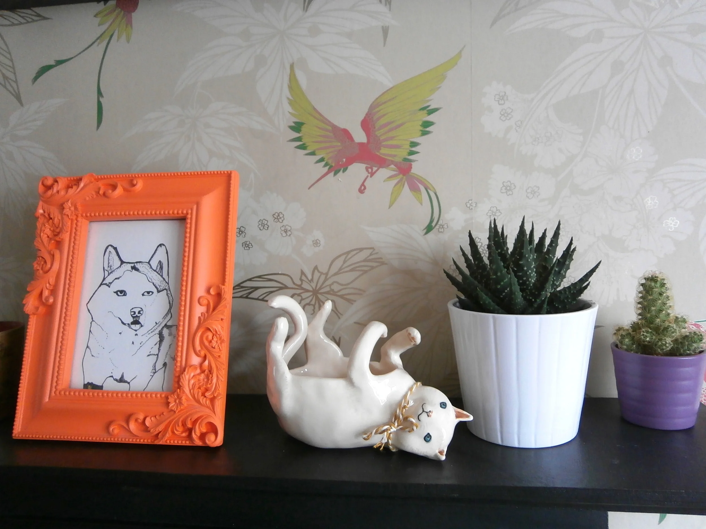
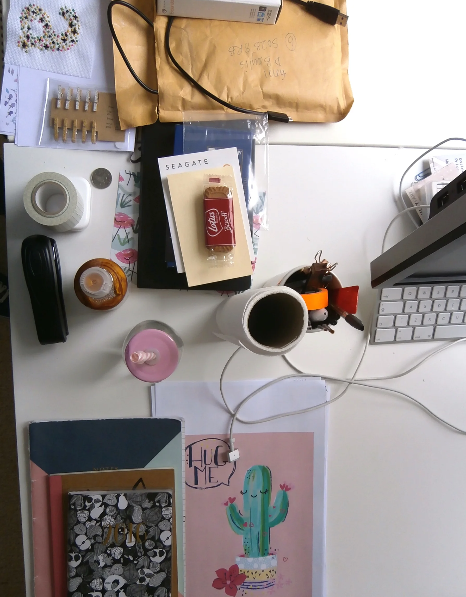
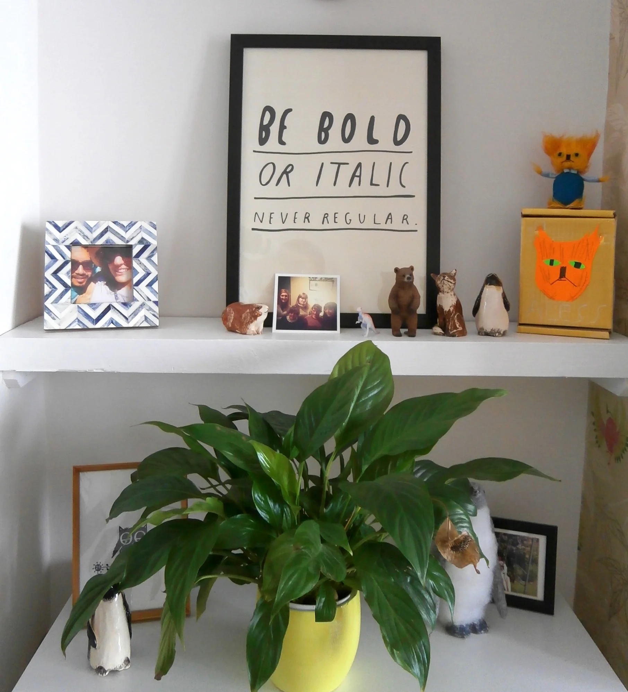
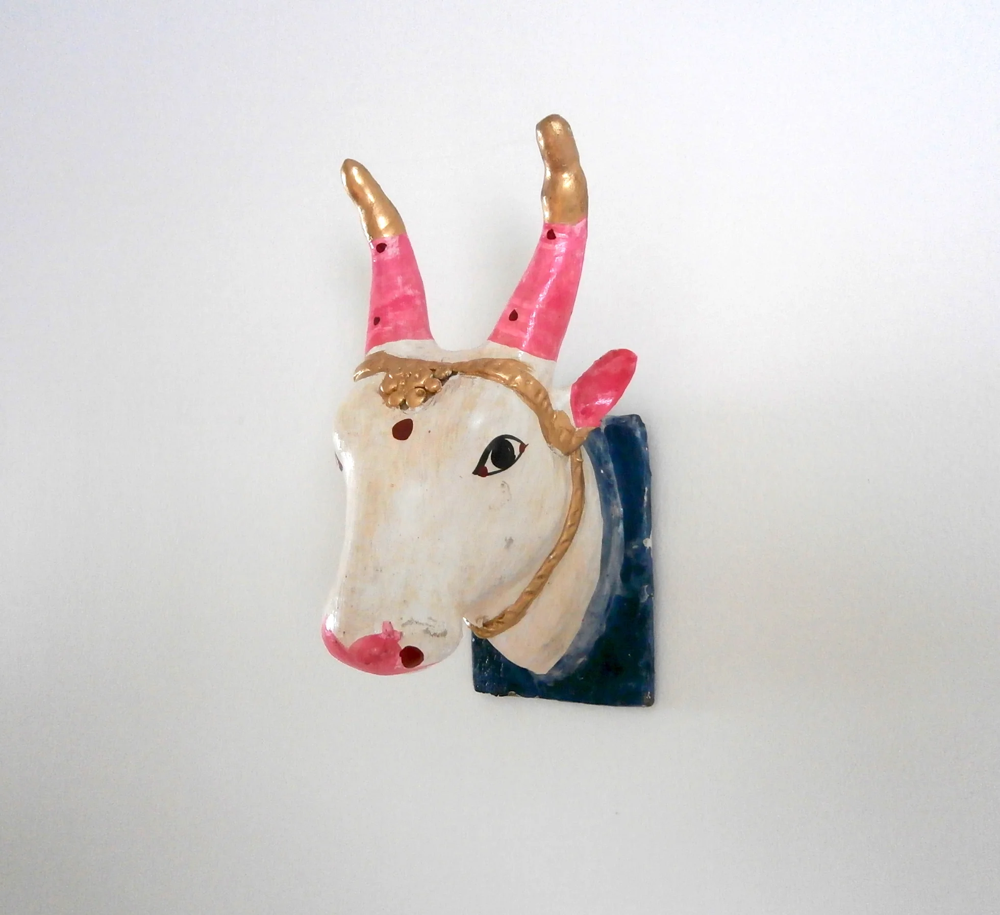
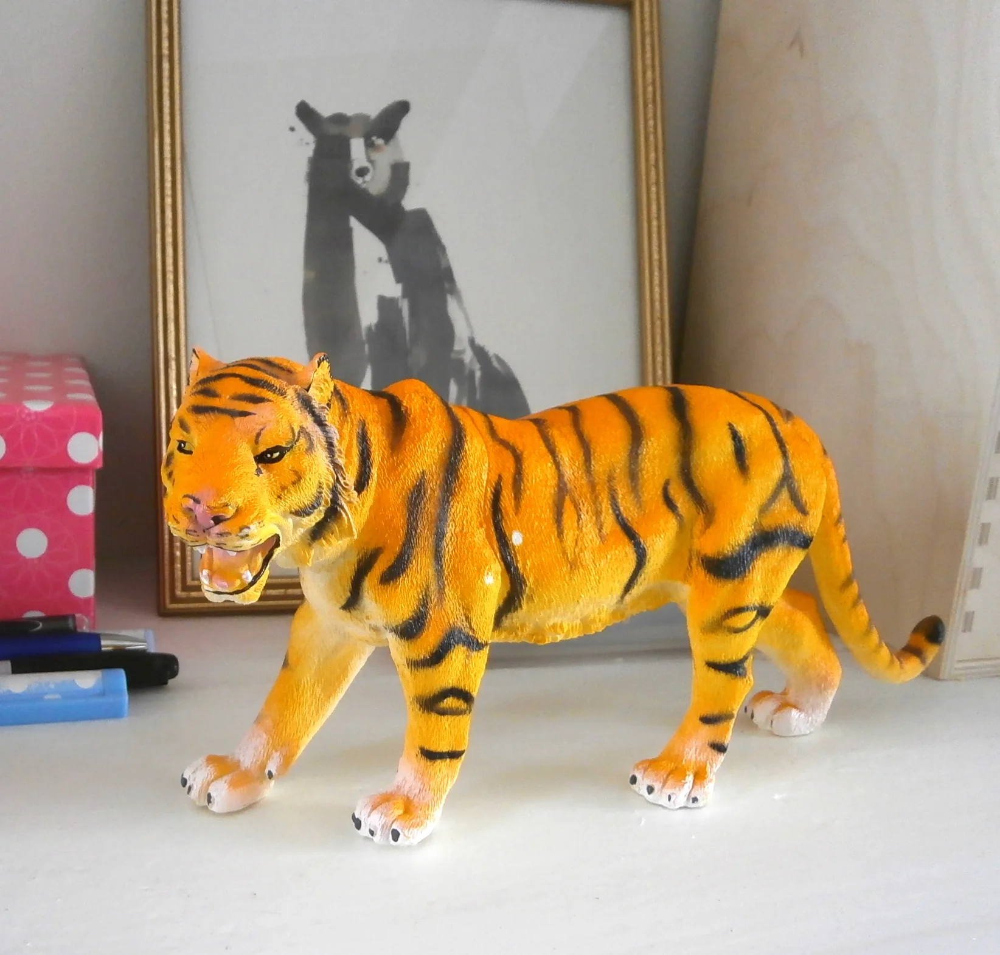
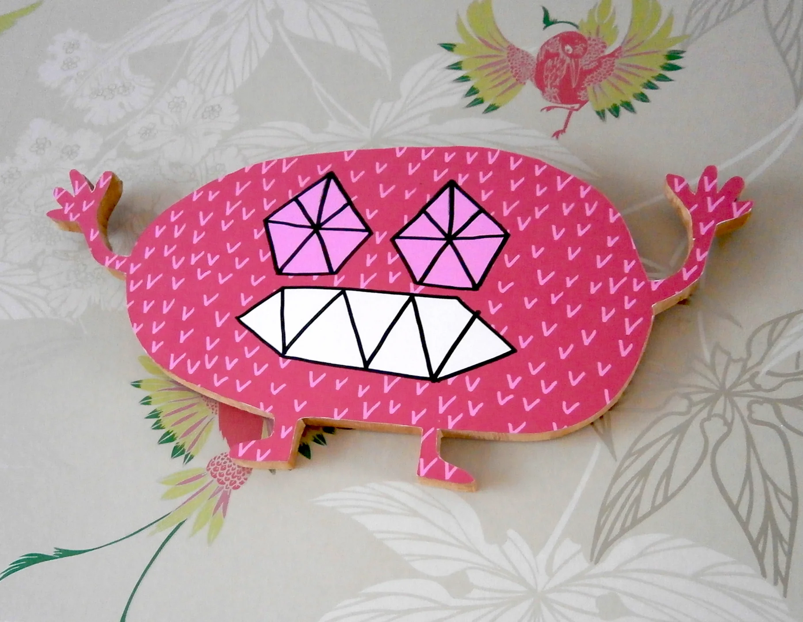

Aless Baylis is an illustrator and print designer living and working in Brighton. Her playful designs currently adorn children's clothing for companies such as Ted Baker and Debenhams, and she's been working on an illustrated alphabet in Spanish; you can check out some of the letters on her Instagram page. We recently had a snoop around the house she shares with her equally stylish boyfriend Mauro.

Aless studied fashion design at Bournemouth Arts Institute, but decided to make the move into print for fashion after realising clothing design wasn't really for her. Her first proper job in illustration was for Winchester-based studio Peagreen, a surface pattern design company focusing on illustration and design for clothing. Aless says, _'I ended up working for them for 2 and a half years (...) it was by far the best job I've ever had.'_

Aless and Mauro's home is an eclectic mix of unique trinkets collected on various holidays and visits to craft markets, as well as splashes of colour, from their pink sofa to the yellow mirror frame in the bathroom. Aless says, 'we didn't really have a specific style for our home, we just wanted it to be colourful and fun. I love having bits of neon here and there, and lots of prints and illustrations.'

Aless is currently obsessed with Smallwild, creator of tiny ceramic animal pendants, and Charlotte Mei whose smiley toast models have been knocking us sideways with cute for the past year or so. When asked how to describe her own work in three words, Aless quite rightly went for 'so flippin' cute!' You can see some examples of her work below.

You can find Aless's work on [Instagram @alessbaylis](https://www.instagram.com/alessbaylis), and on [Twitter @alessbayliss](https://twitter.com/alessbaylis)
